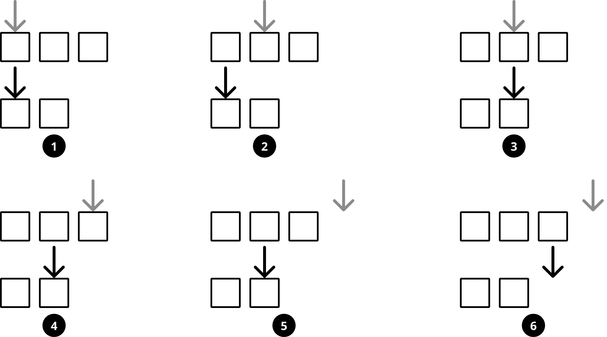

# Описание
Паттерн "каждому по указателю" еще один из разновидностей two pointer.

Принцип паттерна "каждому по указателю" таков:
мы ставим указатели на начало нескольких массивов,
а на каждом шаге сдвигаем один (или несколько) из них по определённому условию.