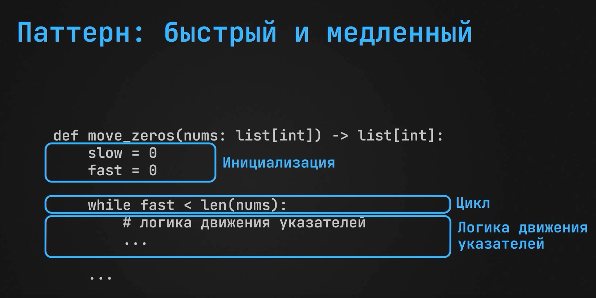

# Описание
## Медленный и быстрый указатель
p2 (быстрый указатель) - двигается на каждой итерации и ищет очередной ненулевой элемент

p1 (медленный указатель) - двигается только тогда, когда p2 указывает на ненулевой элемент. Его задача - указывать на позицию в массиве куда нужно «положить» найденный ненулевой элемент

## Green flags:

- In-Place
- Требуется сохранить исходный порядок